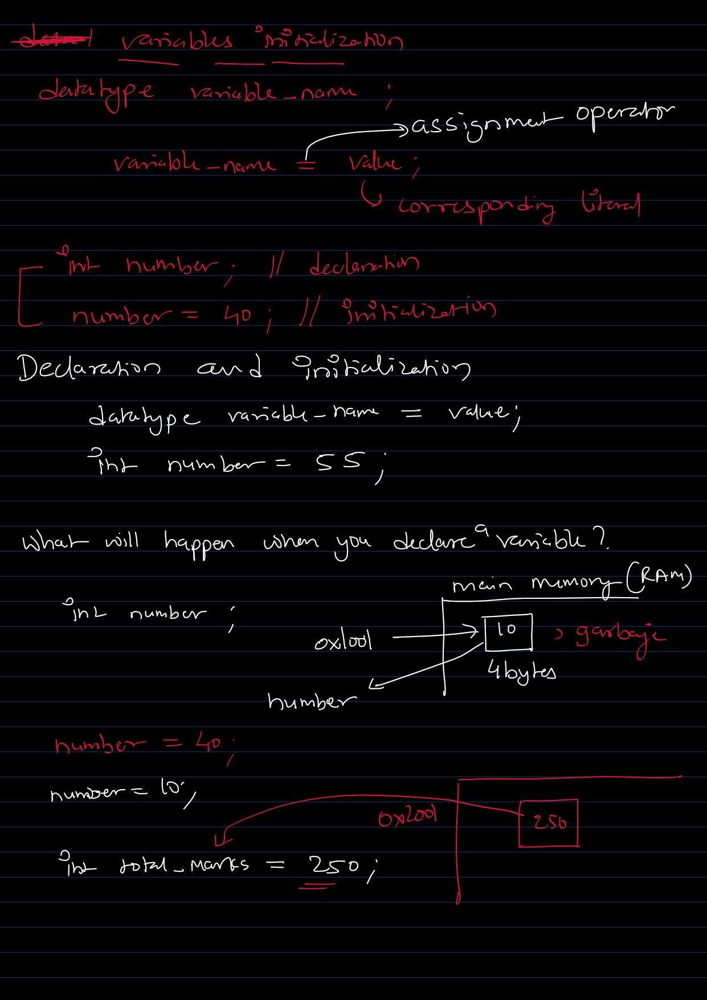
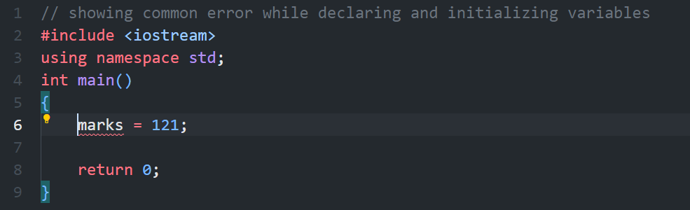
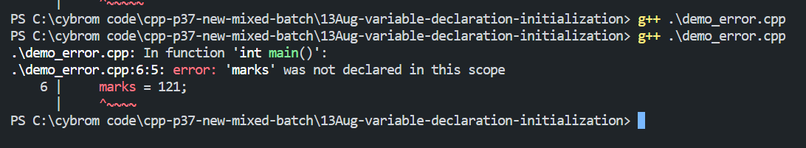
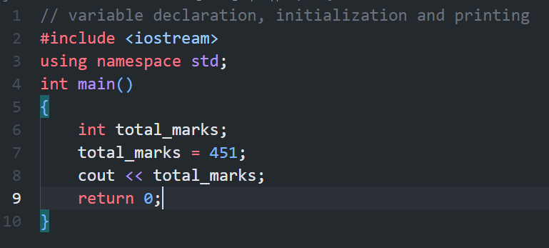

### Variable Declaration and Initialization

- To declare a variable you have to use the following syntax:
    -   ```
            datatype variable_name;
        ```
        ```

            Examples:
            int number;         // will declare an integer variable
            int total_marks;    // will declare an integer variable

            float total_bill_amount;     // will declare a floating point variable
            char gender;            // will declare a charactrer type variable
            double room_temprature;     // will declare a double pricision variable
            bool is_even;           // will declare a boolean variable


        ```
- A variable must be declared before initialization. To initialize a variable use the following syntax:
    -   ```
        variable_name = value;
        ```

        ```

        To initialize we will use the name of variable, = -> assignment operator and coressponding value as per data type of variable

        Eaxmples:
        number = 121; 
        // this will initialize number variable of type int to value 121

        total_marks = 451;  
        // this will initialize number variable of type int to value 1451

        total_bill_amount = 1158.25;
        // this will initialize total_bill_amount variable of type float to value 1158.25

        gender = 'm'; 
        // this will initialize gender variable of type char to value 'm'
        room_temprature = 21.03; 
        // this will initialize room_temprature variable of type double to value 21.03
        is_even = true; 
        // this will initialize is_even variable of type bool to value true

        all the above varibles are declared before assignment / initialization


        ```
- What will happens if you failed to declare a variable before assignment?
    - It will cause a compile time error: 'variable_name' was not declared in this scope

  

#### Printing variable's value using cout
- So, you have already declared and initialize the variable, Now you want to print the value of variable on the console.
- To print, we will use cout and variable name in the following manner:
-   ```
        cout << variable_name;
    ```

    ```
        Example:
        int total_marks;
        total_marks = 451;
        // Now we will print total_marks on console
        cout << total_marks;
    ```
- Sample Program


